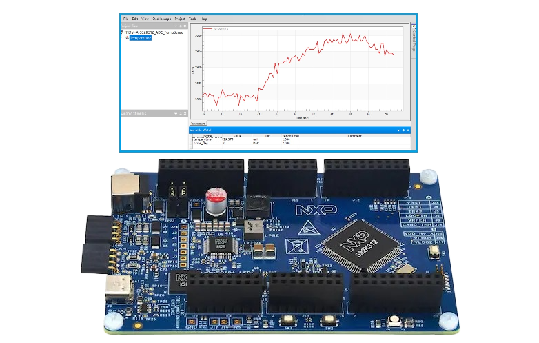
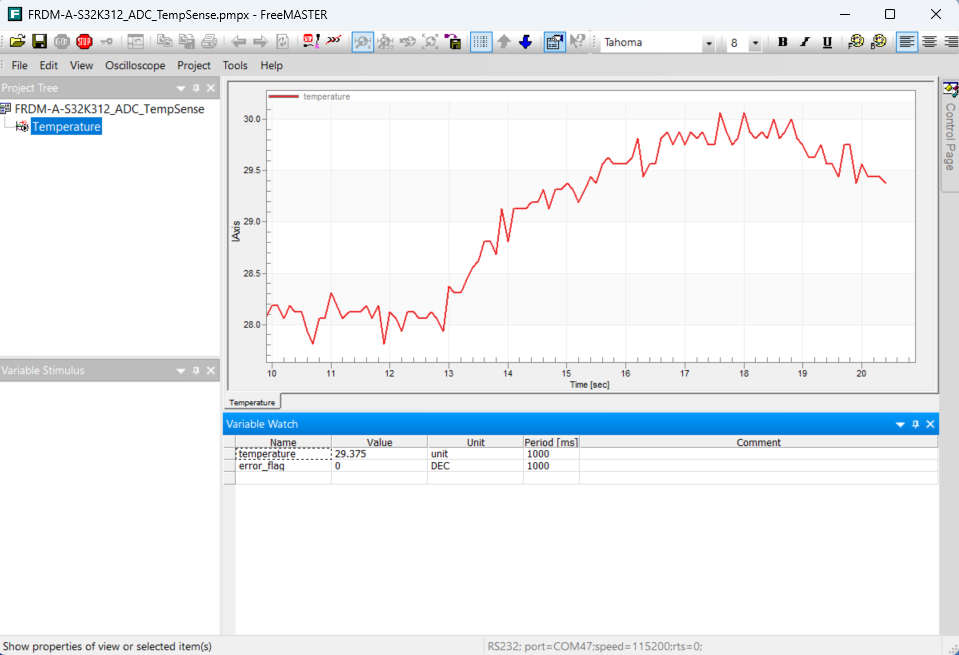

# NXP Application Code Hub

## ADC Temperature Sensing MCAL with FreeMASTER on FRDM-A-S32K312
This demo shows how to configure and use the ADC to read the internal die temperature of the S32K312 microcontroller using the NXP S32K3 AUTOSAR Real-Time Drivers (RTD) MCAL layer and S32 Design Studio.
The example uses the AUTOSAR `Adc` driver TempSense API to continuously poll the on-die temperature sensor, converts the Q11.4 fixed-point result to degrees Celsius, and exposes the reading as a global variable (`temperature`) via the FreeMASTER real-time data visualization tool over LPUART6.
[

](./images/FRDM-A-S32K312-ADC-TempSense.png)

#### Boards: FRDM-A-S32K312
#### Categories: Sensor, ADC
#### Peripherals: ADC, UART, LPUART
#### Toolchains: S32 Design Studio IDE

## Table of Contents
1. [Software and Tools](#step1)
2. [Hardware](#step2)
3. [Setup](#step3)
4. [Results](#step4)
5. [Support](#step5)
6. [Release Notes](#step6)

## 1. Software and Tools
This example was developed using the FRDM Automotive Bundle for S32K3. To download and install the complete software and tools ecosystem, use the following link:
- [S32K3 FRDM Automotive Board Installation Package](https://www.nxp.com/app-autopackagemgr/automotive-software-package-manager:AUTO-SW-PACKAGE-MANAGER?currentTab=0&selectedDevices=S32K3&applicationVersionID=156)
- [FreeMASTER Run-Time Debugging Tool](https://www.nxp.com/design/design-center/software/development-software/freemaster-run-time-debugging-tool:FREEMASTER)

## 2. Hardware
### 2.1 Required Hardware
- Personal Computer
- Type-C USB cable
- [FRDM-A-S32K312](https://www.nxp.com/design/design-center/development-boards-and-designs/FRDM-A-S32K312)[

](./images/FRDM-A-S32K312.png)

### 2.2 Debugger Connection
- Connect the Type-C USB cable to PC and FRDM-A-S32K312 board for power supply and debugging

## 3. Setup

### 3.1 Import the Project into S32 Design Studio IDE
1. Open S32 Design Studio IDE, in the Dashboard Panel, choose **Import project from Application Code Hub**.
   [

](./images/import_project_1.png)

2. Find the demo by searching: [dm-adc-tempsense-freemaster-s32k312](https://mcuxpresso.nxp.com/appcodehub?search=dm-adc-tempsense-freemaster-s32k312)
3. Open the project, click the **GitHub link**, S32 Design Studio IDE will automatically retrieve project attributes, then click **Next>**.
    [

](./images/import_project_3.png)

4. Select **main** branch and then click **Next>**.

5. Select your local path for the repo in **Destination->Directory:** window. The S32 Design Studio IDE will clone the repo into this path, click **Next>**.

6. Select **Import existing Eclipse projects** then click **Next>**.

7. Select the project in this repo (only one project in this repo) then click **Finish**.

### 3.2 Generating, Building and Running the Example
1. In Project Explorer, right-click the project and select **Update Code and Build Project**. This will generate the configuration (Pins, Clocks, Peripherals), update the source code and build the project using the active configuration (e.g. Debug_FLASH).
Make sure the build completes successfully and the *.elf file is generated without errors.
[

](./images/update_and_build.png)
Press **Yes** in the **SDK Component Management** pop-up window to continue.

2. Go to **Debug** and select **Debug Configurations**. There will be a debug configuration for this project:
[

](./images/Debug_config.png)

        Configuration Name                  Description
        -------------------------------     -----------------------
        $(example)_debug_flash_pemicro      Debug the FLASH configuration using PEmicro probe

    Select the desired debug configuration and click on **Debug**. Now the perspective will change to the **Debug Perspective**.
    Use the controls to control the program flow.

### 3.3 How It Works
After initializing the MCU clocks, pin mux, LPUART, and ADC (including a self-calibration pass with `Adc_Calibrate`), FreeMASTER is configured to use **LPUART6** as its serial transport via `FMSTR_SerialSetBaseAddress((FMSTR_ADDR)IP_LPUART_6_BASE)`, then initialized with `FMSTR_Init()`.

In the main loop, `Adc_TempSenseGetTemp()` triggers a one-shot conversion on the internal TempSense channel and returns the result in Q11.4 fixed-point format. Dividing that value by 16 gives the die temperature in degrees Celsius, which is stored in the global `float32 temperature` variable. If the ADC conversion fails, the global `bool error_flag` is set. `FMSTR_Poll()` is called every iteration to service the FreeMASTER communication protocol, making both `temperature` and `error_flag` continuously visible and watchable from the FreeMASTER PC application.

## 4. Results
Results are visualized using the [FreeMASTER Run-Time Debugging Tool](https://www.nxp.com/design/design-center/software/development-software/freemaster-run-time-debugging-tool:FREEMASTER) PC application.

1. Flash and run the application on the FRDM-A-S32K312 board.
2. Open **FreeMASTER** on your PC and load the `FRDM-A-S32K312_ADC_TempSense.pmpx` project file.
3. In FreeMASTER, click the **GO!** green button (**Start Communication**) to connect; it will search the COM port of the board at baud rate **115200**.
4. The `temperature` variable will update in real time, showing the on-die temperature in degrees Celsius.
5. If the ADC conversion fails, the `error_flag` variable will be set to `true`.
6. See the plot on the FreeMASTER application below:
[

](./images/FRDM-A-S32K312_ADC_TempSense_FM.png)

## 5. Support
For general technical questions related to NXP microcontrollers, please use the [NXP Community Forum](https://community.nxp.com/).
#### Project Metadata

<!----- Boards ----->

<!----- Peripherals ----->

<!----- Toolchains ----->

Questions regarding the content/correctness of this example can be entered as Issues within this GitHub repository.

>**Note**: For more general technical questions regarding NXP Microcontrollers and the difference in expected functionality, enter your questions on the [NXP Community Forum](https://community.nxp.com/)

## 6. Release Notes
| Version | Description / Update                           | Date                        |
|:-------:|------------------------------------------------|----------------------------:|
| 1.0     | Initial release on Application Code Hub        | June 17th 2026   |
